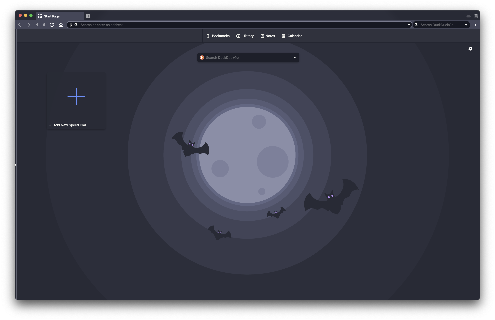

# Dracula for [Vivaldi](https://vivaldi.com)

> A dark theme for [Vivaldi](https://vivaldi.com).

## Install

All instructions can be found at [draculatheme.com/vivaldi](https://draculatheme.com/vivaldi).

1. Go to Vivaldi Menu > Preferences > Themes
1. At the bottom of the window, look for a plus sign
1. Enter following colors
  1. Background: #282a36
  1. Foreground: #f8f8f2
  1. Highlight: #6272a4
  1. Accent: #44475a

## Team

This theme is maintained by the following person(s) and a bunch of [awesome contributors](https://github.com/dracula/template/graphs/contributors).

 |
--- |
[Christian Rackerseder](https://github.com/screendriver) |

## License

[MIT License](./LICENSE)
